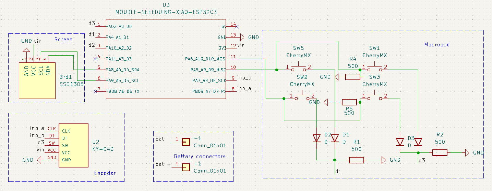
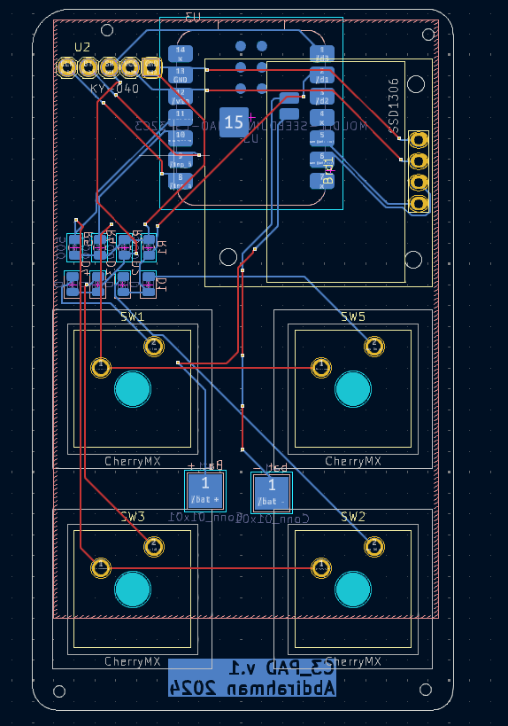

# XIAO-ESP32C3 bluetooth Macropad (C3_Pad) 
A custom Macropad using a Xiao esp32c3 micorcontroller. 

This projects includes: 
- Arduino sketch
- PCB design
- Bill of material 
- 3d print case 

## Arduino sketch 
The project requires these libraries to compile: 
- [Encoder by Paul Stoffregen](https://github.com/PaulStoffregen/Encoder)
- [u8g2 by olikarus](https://github.com/olikraus/u8g2)
- [ESP32-BLE-Combo by Georgegipa](https://github.com/Georgegipa/ESP32-BLE-Combo)

## PCB design
I'm new to PCB design and __highly recommend__ you to check it out before using the design. 

### Schematic 

__N.B!__ 
The xiao esp32c3 symbol doesn't include the battery connectors. So, I've manualy connected them on the PCB editor

### pcb

### 3d model

# Bill of material (BOM)
| component             | website | 
| --------              | ------- |
| SSD1306 OLED          | [link](https://www.amazon.com/HiLetgo-Adafruit-Beaglebones-Raspberry-Optional/dp/B06XRBYJR8?th=1)    |
| KY-040 encoder        | [link](https://www.amazon.com/JTAREA-KY-040-Encoder-Encoders-Modules/dp/B0D2TW63G1/ref=sr_1_1_sspa?)   |
| TP4056 charger        | [link](https://www.amazon.com/HiLetgo-Lithium-Charging-Protection-Functions/dp/B07PKND8KG/ref=sr_1_1_sspa?)    |
| Cherry MX silent red  | [link](https://www.amazon.com/Cherry-MX-RGB-Mechanical-Keyboard/dp/B0CBS4QYXS/ref=sr_1_1?)    |
| Xiao ESP32c3          | [link](https://www.seeedstudio.com/Seeed-XIAO-ESP32C3-p-5431.html)     |

# 3d print case 
__Not finished__ 
